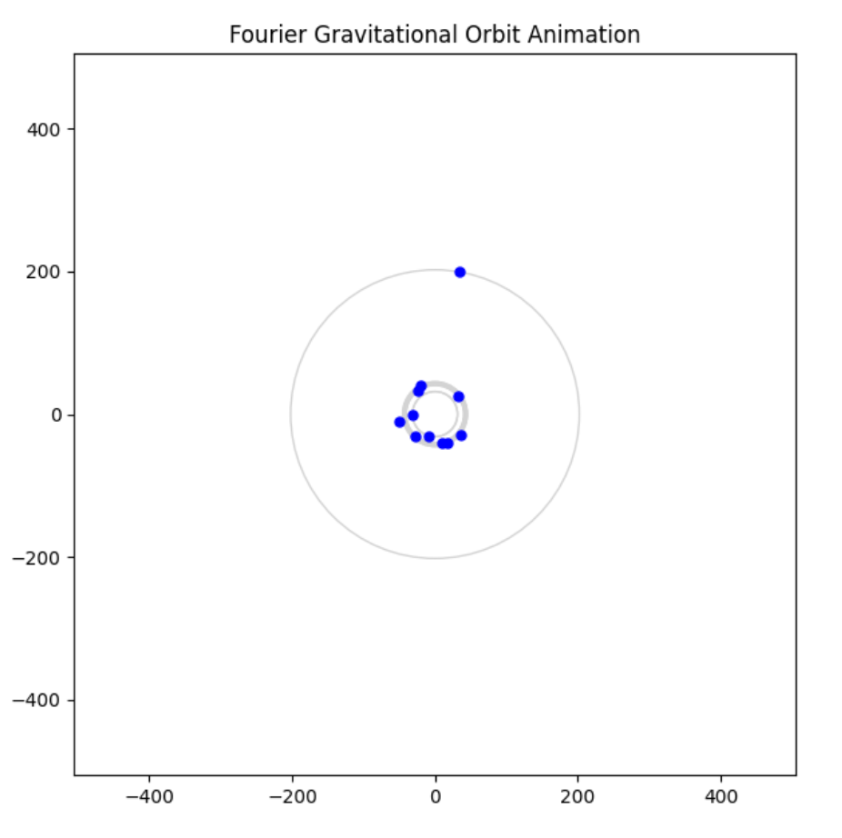

# Gravitational Transform

## Motivation

If you wanted to store information for the longest amount of time possible, how would you do it? Computer chips will fail in centuries, etchings in stone will only last thousands, and even more creative answers like DNA encoding can only theoretically last millions. Meanwhile, planetary system orbits can be stable for billions of years, and orbital patterns can encode information in the frequency domain. So, an unrealistic but interesting answer to the posed question is to transform the desired piece of information into orbital patterns with different masses and store the information within the dynamics of the system. However, this is only in the ideal case. Planetary systems evolve over time, so how does this change the message they encode?

### The Gravitational Transform

The Gravitational transform (GT) is a transform that takes in arbitrary data (in this implementation, this is strings) and computes a mapping between this data and orbital parameters. This mapping is done through using a Fourier transform as well as Newtonian physics and Kepler's laws. The system is then run with an N-body simulator and integrated over a specified time frame. Afterwards, we can obtain an evolved 'echo' of the original data. 

# Process

## 1. Fourier Decomposition
Given a discrete signal $f[n]$, we compute its discrete Fourier transform:

$$
\hat{f}_k = \sum_{n=0}^{N-1} f[n] e^{-2\pi i kn/N}
$$

For each mode $k$, define:

$$
A_k = |\hat{f}_k|, \qquad 
\phi_k = \arg(\hat{f}_k)
$$

## 2. Spectral mapping
Each Fourier mode becomes a planet. We use:

### **Amplitude to Orbital Radius**
$$
r_k = s_r \, A_k^\gamma, \qquad 0.5 \le \gamma \le 0.8
$$

This is mostly done to make the inverse transform easier while also making the visualizations well spaced.

### **Phase becomes the initial angle**
$$
\theta_k = \phi_k
$$

### **Circular orbital velocity**
Each planet has a velocity:

$$
v_k = \sqrt{\frac{G M_\star}{r_k}}
$$

where $M_\star$ is a large fixed central mass.

### **Mass**
Planet masses actually don't need to encode any data, because our implementation includes a large central star of fixed position and mass.

Then each parameter is:
$$
\mathbf{r}_k(0) = 
\begin{bmatrix}
r_k \cos\theta_k \\
r_k \sin\theta_k
\end{bmatrix},
\qquad
\mathbf{v}_k(0) =
\begin{bmatrix}
- v_k \sin\theta_k \\
+ v_k \cos\theta_k
\end{bmatrix}
$$

## 3. Gravitational Simulation
The system evolves using an N-body integrator under Newton’s laws:

$$
\frac{d^2\mathbf{r}_i}{dt^2} =
G \sum_{j\ne i}
m_j \frac{\mathbf{r}_j - \mathbf{r}_i}
{|\mathbf{r}_j - \mathbf{r}_i|^3 }
$$

This produces different trajectories:

$$
\mathcal{G}(f) = \{ \mathbf{r}_k(t), \, \mathbf{v}_k(t) \}_{k=1}^N
$$

The original message evolves under these laws and this changes the content of the original information.

# Inverse Transform 

To decode at time $t$, we just need each planet's:

$$
r_k(t) = \|\mathbf{r}_k(t)\|,
\qquad
\theta_k(t) = \text{atan2}(y_k(t), x_k(t))
$$

Then invert the original mapping:

$$
\hat{A}_k(t) = \left(\frac{r_k(t)}{s_r}\right)^{1/\gamma}
$$

$$
\hat{\phi}_k(t) = \theta_k(t)
$$

The nodes are then:

$$
\hat{f}_k(t) = \hat{A}_k(t) \, e^{i\hat{\phi}_k(t)}
$$

Inverse FFT:

$$
f_t[n] = \Re\left( IFFT(\hat{f}_k(t)) \right)
$$

Then just convert back to characters! Each value is rounded to the nearest ASCII mapping:

An example of "hello world":

